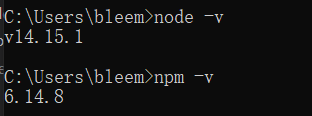
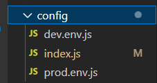
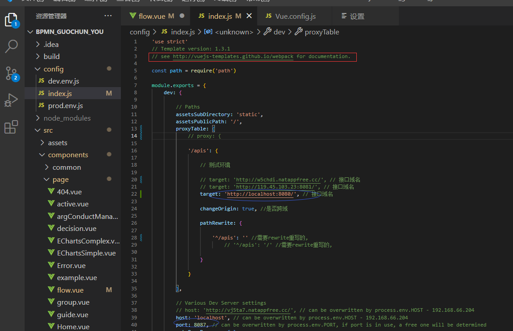
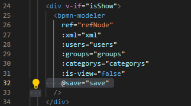
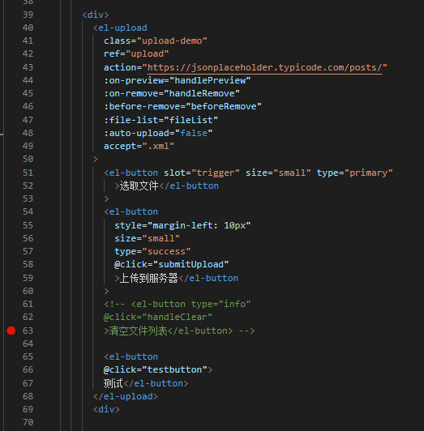
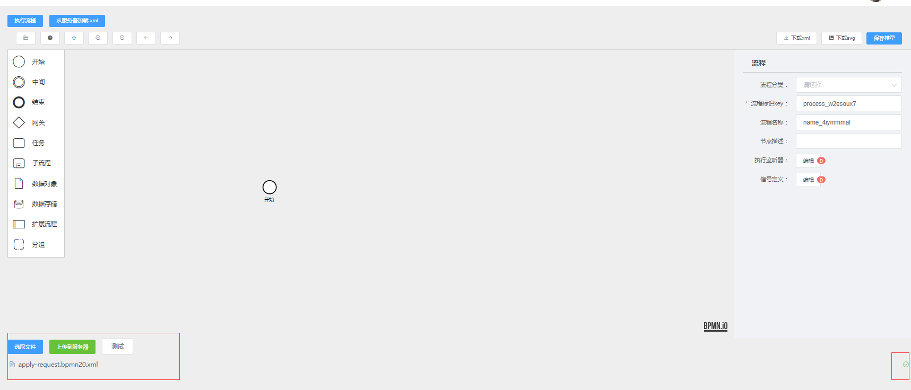

# 成功本地安装好前端后端的环境

前端node和npm的版本如下




后端仓库

```javascript
https://github.com/HIT-CS-509/ag-bpmn
```

# 前端大致理解

* 仓库地址：

```javascript
https://github.com/bleemyoung/BPMN_guochun_you.git
```

是从尤国淳学长的仓库fork过来的，其中dist打包好的文件夹被我删了（build，大概，我之前没用过），以后如果要打包的话我再参考，目前这个文件目录下内容没用。


* 配置文件



详细可以参考红框标出的官方文档



target对应代理的接口，'apis'是全局写url是将apis替换成代理的target，port对应的你前端开的端口，有时候前端or后端打不开可能是因为端口被其他进程占用了。


* bpmn部分

这里的bpmn是写死的，只能调用封装好暴露出来的接口，例如save。

如果接下来需要换一种bpmn的话还得几个人继续研究




暂时的解决思路：添加upload组件，通过下载xml到本地，再上传本地xml文件到服务器解决。






# 目前的任务

* 前端

  * bpmn农事流程管理

    * 修改bpmn的几个URL，跟后端对接。
    * 新增侧边框，可以跟曹栋辉做的merge一下
  * 农事活动管理

    * 暂略
  * 农事决策管理

    * 重新写一个input和output的表
    * 实现用户自定义能够生成表
* 后端

  * 农事活动管理和农事决策可以两个人继续做
  * 农事资源，农事指导未做。
